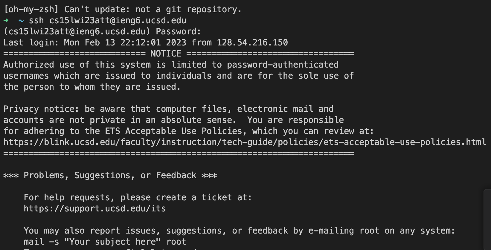
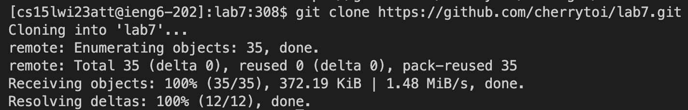
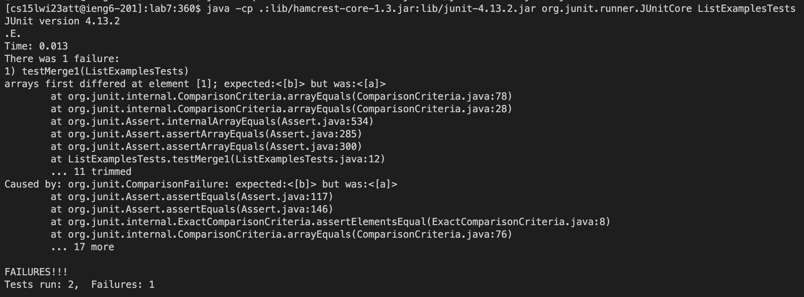
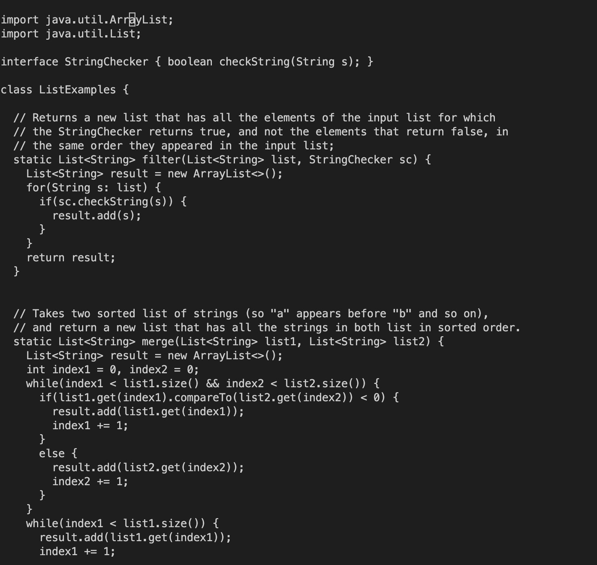
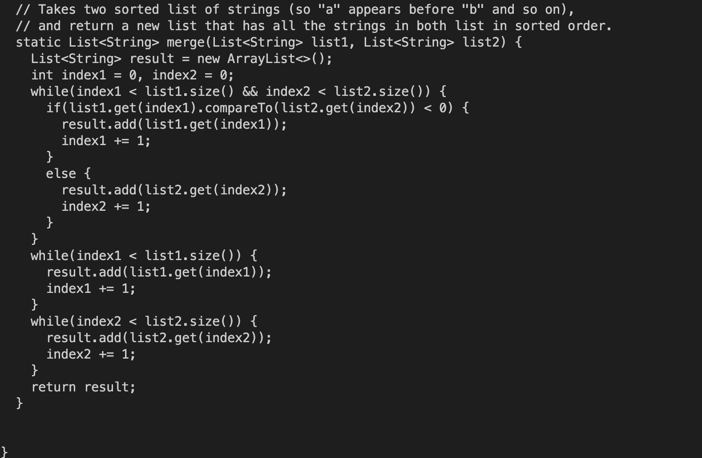
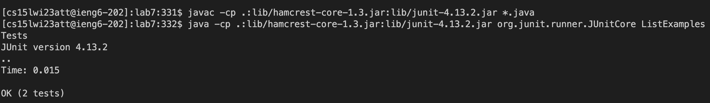

# Lab Report 4

Step 4

Note: I had to borrow my friend Mandy's ieng6 account information because I couldn't successfully login with mine but all work assured is done on my laptop without any collaboration with Mandy.

Keys pressed: typing in the login <cs15lwi23att@ieng6.ucsd.edu> <enter> and then the password <enter>

Step 5

I copied the forked github repo link from my github account.
  
Keys pressed: git clone Ctrl+V <enter>

Step 6

typed cd then lab 7 then <enter>
  
Copied and pasted the compile command for the JUnit testing on the Mac provided in the week 3 of the cs15lwi23 github then pressed <enter>
  
Copied and pasted the run command except for the end that states <ArrayTests> for the JUnit testing on the Mac provided in the week 3 of the cs15lwi23 github and added ListExamplesTest to the terminal then pressed <enter>

Step 7

Ran into errors so I typed nano ListExamples.java to access the nano editor and fix the code.

Keys pressed: <down> 14 times then <right> 21 times then <backspace> 2 times to delete the <,0>
To fix the second error, I pressed <down> 28 more times and <left> 6 times to replace the "1" with "2" for "index1"

Next, I pressed Ctrl + X to exit the nano editor and <Y> to confirm to save changes. Then I pressed <enter> to return to the terminal.

Step 8

Keys pressed: <up> 3 times to go back to the compile command, <'enter'>, <up> 3 more times to go back to the run command, <enter>

Step 9

